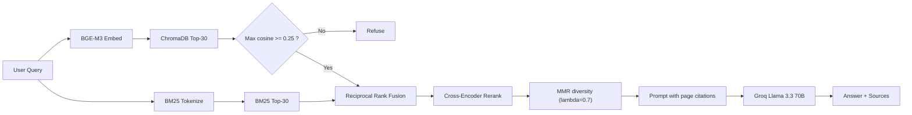

# FYP Handbook RAG — Final Implementation Plan

High-accuracy Retrieval-Augmented Generation pipeline over the FAST-NUCES *BS Final Year Project Handbook 2023*. Hybrid retrieval (dense + sparse), cross-encoder reranking, MMR diversity, heading-aware chunking, and Groq-hosted Llama 3.3 70B for answer generation. Managed with `uv`.

---

## 1. Tech Stack

| Component | Choice | Why |
|---|---|---|
| Pkg manager | `uv` | Fast, deterministic, project-native |
| PDF parser | `PyMuPDF` (`fitz`) | Page-level text + font/size/bold spans for heading detection |
| Chunker | Heading-aware sectioner + `RecursiveCharacterTextSplitter` (500/100) | Respects logical structure, preserves citations |
| Dense embedder | `BAAI/bge-m3` | 1024-d, multilingual, top MTEB at its size, fully local |
| Sparse | `rank_bm25` (BM25Okapi) | Recall on exact-token queries (e.g. "Ibid.", "op. cit.") |
| Hybrid fusion | Reciprocal Rank Fusion (RRF, k=60) | Score-free, robust to scale mismatches |
| Reranker | `BAAI/bge-reranker-v2-m3` (cross-encoder) | Precision boost over bi-encoder candidates |
| Diversity | MMR (lambda=0.7) | Removes near-duplicate chunks before LLM |
| Vector DB | ChromaDB (PersistentClient, cosine) | Local, persisted, native metadata support |
| Refusal gate | dense cosine >= 0.25 | Assignment-mandated, executed pre-LLM |
| LLM | Groq `llama-3.3-70b-versatile` (temp 0.1) | Fast free tier, faithful citations |
| UI | Streamlit | Meets all assignment UI requirements |

---

## 2. Project Structure

```
A03/
├── pyproject.toml              # uv-managed
├── .python-version             # 3.12
├── .env.example                # GROQ_API_KEY=
├── .gitignore
├── README.md                   # quickstart + uv commands
├── plan.md                     # this file
├── ingest.py                   # ROOT: build vector + BM25 indexes
├── app.py                      # ROOT: Streamlit UI
├── ask.py                      # ROOT: CLI fallback
├── prompts.txt                 # deliverable, auto-generated by evaluate.py
├── docs/
│   ├── 3. FYP-Handbook-2023.pdf
│   └── requirements.md
├── src/fyp_rag/
│   ├── __init__.py
│   ├── config.py               # paths, models, k/threshold/chunk sizes
│   ├── logger.py
│   ├── pdf_loader.py           # PyMuPDF page extraction with span dict
│   ├── chunker.py              # heading-aware sectioning + recursive sub-chunking
│   ├── embedder.py             # BGE-M3 singleton, batch encode
│   ├── vector_store.py         # ChromaDB persist + query + embedding fetch
│   ├── bm25_store.py           # BM25 build/persist/query, regex tokenizer
│   ├── retriever.py            # RRF + threshold + MMR
│   ├── reranker.py             # BGE-reranker-v2-m3 cross-encoder wrapper
│   ├── prompt.py               # SYSTEM_PROMPT + build_user_prompt
│   ├── llm.py                  # Groq client + retry on 429
│   └── pipeline.py             # answer(query) end-to-end
├── scripts/
│   ├── __init__.py
│   ├── evaluate.py             # 6 validation Qs + 1 OOD; writes prompts.txt + outputs/eval.json
│   └── make_report_pdf.py      # markdown -> 1-2 page PDF via ReportLab
├── data/
│   ├── chroma/                 # persisted ChromaDB
│   ├── bm25.pkl                # persisted BM25 index
│   └── chunks.pkl              # id -> {text, metadata} lookup
├── outputs/
│   ├── eval.json               # structured evaluation output
│   └── screenshots/            # user-supplied UI screenshots for the report
└── report/
    ├── report.md               # source for 1-2 page PDF deliverable
    └── report.pdf              # rendered deliverable
```

---

## 3. Dependencies (`pyproject.toml`)

```toml
dependencies = [
    "pymupdf>=1.24.0",
    "langchain-text-splitters>=0.3.0",
    "sentence-transformers>=3.0.0",
    "chromadb>=0.5.0",
    "rank-bm25>=0.2.2",
    "streamlit>=1.38.0",
    "groq>=0.11.0",
    "python-dotenv>=1.0.0",
    "numpy>=1.26.0",
    "tqdm>=4.66.0",
    "nltk>=3.9.0",
    "reportlab>=4.2.0",
]
```

Install once:

```bash
uv sync
```

Heavy assets fetched on first run:
- `torch` (~2.5 GB) via sentence-transformers
- `BAAI/bge-m3` model (~2.27 GB)
- `BAAI/bge-reranker-v2-m3` model (~2.27 GB)

---

## 4. Pipeline Phases

### 4.1 Ingest (`ingest.py`)

```
PDF -> extract_pages (PyMuPDF, page+spans+median font size)
    -> chunk_pages    (heading-aware sectioner + recursive splitter)
    -> embed_texts    (BGE-M3, normalized)
    -> reset_collection + add_chunks (ChromaDB cosine)
    -> build_index    (BM25Okapi, persisted)
    -> chunks.pkl     (id -> {text, metadata})
```

Heading detection in `chunker.py` uses font-size > 1.15x median, bold flag, ALL-CAPS short lines, and numbered prefixes (`^\d+(\.\d+)*\s+[A-Z]`). Sections shorter than 120 chars merge into the next; sections longer than 800 chars sub-split with `RecursiveCharacterTextSplitter(500, 100)`.

### 4.2 Retrieve (`src/fyp_rag/retriever.py`)

```python
dense_hits = chroma.query(embed(query), k=30)        # cosine top-30
bm25_hits  = bm25.query(tokenize(query), k=30)       # BM25 top-30

if max(h.similarity for h in dense_hits) < 0.25:
    return refusal()                                  # assignment-mandated gate, no LLM call

fused = rrf(dense_hits, bm25_hits, k=60)[:20]        # Reciprocal Rank Fusion
reranked = cross_encoder.predict(fused)[:10]          # BGE-reranker-v2-m3
filtered = [h for h in reranked if h.score >= -2.0]   # secondary guard
final    = mmr(filtered, embeddings, lambda=0.7)[:5]  # diversity
```

### 4.3 Generate (`src/fyp_rag/llm.py` + `prompt.py`)

System prompt forces:
- Context-only answers
- Inline `(p. X)` / `(p. X-Y)` citations on every factual claim
- Exact refusal string when context insufficient
- No outside knowledge / no invented page numbers

Groq `llama-3.3-70b-versatile`, `temperature=0.1`, `max_tokens=1024`, retries on 429.

### 4.4 UI (`app.py`)

- Title, caption, single text_input + "Ask" button
- Spinner during retrieval/generation
- Answer panel
- "Sources (page refs)" expander: page label, section, similarity / rerank / RRF scores, 400-char snippet
- Debug expander: top-30 dense + top-30 BM25 + RRF candidates
- Prompt expander: full system + user prompts that hit the LLM
- Sidebar slider for k and threshold (live re-run)

---

## 5. Data Flow



---

## 6. Validation

`scripts/evaluate.py` runs all 6 required queries plus 1 out-of-domain probe, then:
1. Writes `outputs/eval.json` (structured per-query results)
2. Writes `prompts.txt` (system prompt + per-query user prompt + raw response)
3. Prints a console summary with cited pages

| # | Question | Expected Pages |
|---|---|---|
| 1 | Headings, fonts, sizes | 39 |
| 2 | Margins / spacing | 39 |
| 3 | Development FYP chapters | 41 |
| 4 | R&D FYP chapters | 42-43 |
| 5 | Ibid. / op. cit. usage | 38 |
| 6 | Executive Summary / Abstract | 36 |
| OOD | Cafeteria menu | refusal |

---

## 7. Run Commands

```bash
uv sync                                       # install deps (one-time)
cp .env.example .env                          # add your Groq API key
uv run python ingest.py                       # build chroma + bm25 (one-time)
uv run streamlit run app.py                   # UI
uv run python ask.py "What margins do we use?"   # CLI
uv run python scripts/evaluate.py             # validation + prompts.txt
uv run python scripts/make_report_pdf.py      # render report/report.pdf
```

---

## 8. Deliverables (mapped to assignment spec)

| Required | Provided by |
|---|---|
| `ingest.py` | Root entry point; imports `src/fyp_rag/*` |
| `app.py` (Streamlit) | Root entry point with sources expander, debug, prompt views |
| `ask.py` (CLI alt.) | Root entry point with `--debug` flag |
| `prompts.txt` | Generated by `scripts/evaluate.py` |
| `report.pdf` | Generated by `scripts/make_report_pdf.py` from `report/report.md` |
| Vector DB persisted to disk | `data/chroma/` (ChromaDB PersistentClient) |
| Page-cited answers | Enforced by system prompt + per-chunk metadata |
| Threshold refusal | Pre-LLM cosine gate at 0.25 |
| Sources panel | Streamlit "Sources (page refs)" expander |
